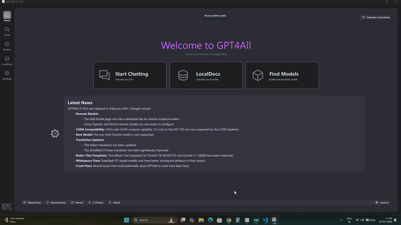
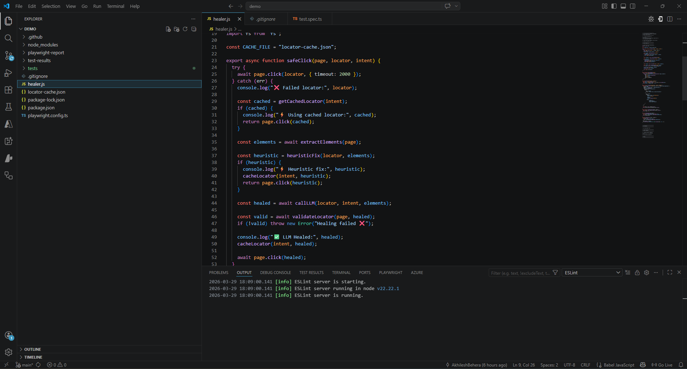
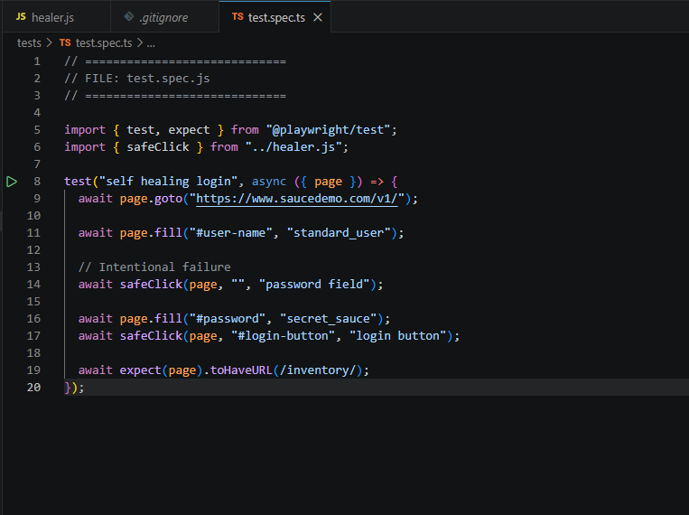

# 🤖 AI Self-Healing Test Automation Framework


---
## 🎥 Demo
## 🎥 Self-Healing Demo

❌ Broken locator → ⚡ Auto-healed → ✅ Test passes


## 🎥 Self-Healing Demo Screenshots



##🎥 Video

Github Link - ▶️ 

Youtube Link -▶️ [Watch Full Demo on YouTube](https://www.youtube.com/watch?v=oIAtOplikAM)

## 🚀 Overview

This project is an **AI-powered Self-Healing Test Automation Framework** built using **Playwright and JavaScript**, designed to automatically recover from broken locators during test execution.

Instead of failing when UI changes occur, the framework intelligently detects failures, analyzes the DOM, and dynamically fixes locators using a combination of:

* ⚡ Heuristic Matching
* 🧠 Fuzzy Logic (Levenshtein Distance)
* 🤖 Local LLM (Qwen / Llama)
* 💾 Persistent Caching

---

## 🧠 Key Features

* 🔁 **Self-Healing Locators** – Automatically fixes broken selectors
* ⚡ **Fast Failure Detection** – Avoids long Playwright timeouts
* 🧩 **DOM Intelligence** – Extracts structured element data
* 🤖 **LLM Integration** – Uses local AI models for smart recovery
* 💾 **Locator Caching** – Stores healed locators for reuse
* 🛡️ **Validation Layer** – Ensures locator uniqueness before retry
* 🔄 **Retry Mechanism** – Executes action after healing

---

## 🏗️ Architecture Diagram

```
          Playwright Test
                │
                ▼
        Action Execution (click/fill)
                │
        ┌───────┴────────┐
        ▼                ▼
   Success ✅        Failure ❌
                         │
                         ▼
                Self-Healing Engine
                         │
        ┌─────────┬──────────┬──────────┐
        ▼         ▼          ▼
     Cache   Heuristic    LLM (AI)
        │         │          │
        └─────────┴──────────┘
                         │
                         ▼
                 Validation Layer
                         │
                         ▼
                     Retry Action
                         │
                         ▼
                      Success ✅
```

---

## 🛠️ Tech Stack

* **Playwright** – End-to-end test automation
* **Node.js (ES6)** – Runtime environment
* **JavaScript** – Core logic
* **Ollama / GPT4All** – Local LLM execution
* **Levenshtein Distance** – Fuzzy matching

---

## 📂 Project Structure

```
project/
│── healer.js            # Self-healing engine
│── tests/
│   └── test.spec.js     # Playwright test cases
│── locator-cache.json   # Stored healed locators
│── package.json         # Dependencies
│── README.md            # Documentation
```

---

## ⚡ Getting Started

### 1️⃣ Install Dependencies

```
npm install
npx playwright install
```

---

### 2️⃣ Run Local LLM (Recommended)

```
ollama run qwen2.5:7b
```

---

### 3️⃣ Execute Tests

```
npx playwright test
```

---

## 🧪 Example Scenario

### ❌ Broken Locator

```
await safeClick(page, "#passwor", "password field");
```

### ✅ Framework Output

```
❌ Failed locator: #passwor
⚡ Heuristic fix: #password
```

👉 Test continues successfully without manual intervention.

---

## 🧠 What I Learned

* Designing **resilient automation frameworks**
* Implementing **self-healing mechanisms**
* Handling **Playwright timeouts & lifecycle issues**
* Working with **DOM parsing and structured data**
* Integrating **local LLMs for intelligent automation**
* Applying **prompt engineering techniques**

---

## ⚔️ Challenges & Solutions

### ❌ Locator Failures

Solved using heuristic + AI-based recovery.

### ⏱️ Timeout Issues

Reduced timeout to fail fast and trigger healing.

### 🤖 LLM Hallucination

Added strict prompts + validation layer.

### 🔁 Repeated Failures

Implemented persistent caching.

### 🧩 Weak Matching

Improved accuracy using fuzzy matching.

---

## 🚀 Future Enhancements

* 📊 HTML Dashboard for healing logs
* 🤖 Confidence scoring for AI outputs
* 🔄 CI/CD integration
* 🌙 Visual testing integration
* 🧠 Full AI agent (MCP-based architecture)

---

## 👨‍💻 Author

**Akhilesh Behera**
Software Tester | QA Engineer | AI Automation Enthusiast

---

## 📜 License

This project is licensed under the **MIT License**.

---

## ⭐ If you like this project

Give it a ⭐ on GitHub and share it with others!
